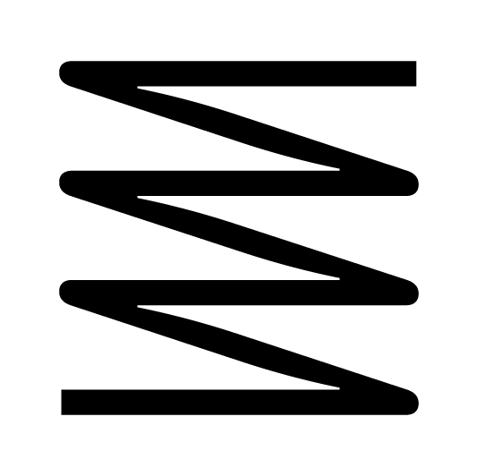
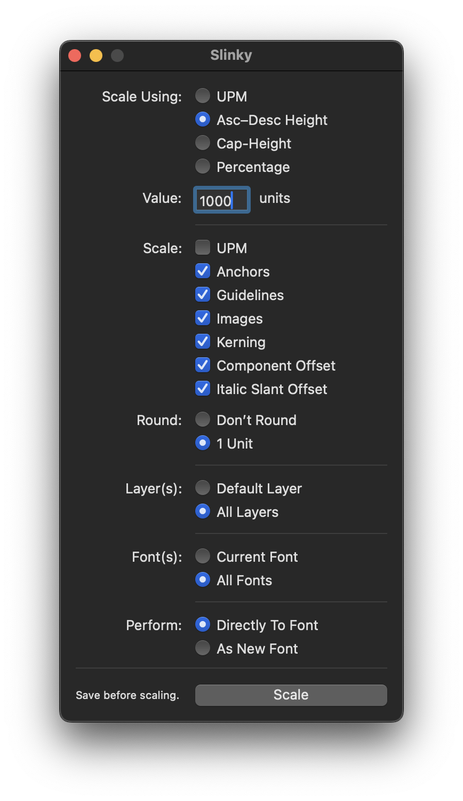

# Slinky

#### Slinky is a RoboFont extension for scaling your whole font up or down.

Choose a precise unit-based measurement (UPM, Ascender-to-Descender Height, Cap-Height) or a percentage, set some settings, and Slinky will do the rest.

## Scale Using

This is what your measurement will correspond to. You can scale based on UPM (units per em, a.k.a. the height of the glyph body), your ascender-to-descender height, your cap-height, or b a percentage. Where possible, you’ll have the option on which aspects of your font(s) get scaled...

## Value

Enter your desired measurement here, measured in units, unless Percentage is chosen above.

## Scale

These are things you can choose to scale along with everything else. Usually it’s a good idea to leave all of these checked (except for UPM, unless you're basing the scaling off the UPM). 
> Note: Components themselves will not be scaled, as it would essentially scale things twice. It is recommended you scale the **Component Offset** (i.e. the positioning of the components). This will most likely lead to the desired results.

## Round

When you scale drawings, there may be `float` (decimal) numbers that no longer fit the grid you're working on. If you'd like to leave them `float` for now, choose Don’t Round. If you'd like your final drawings to be shimmied a bit to fit a 1-unit grid, choose 1 Unit.

## Layer(s)

Choose which layers you’d like to scale, either just the default layer (usually named “foreground”), or all layers.

## Font(s)

Choose which fonts you’d like to scale, either just the front-most `Current Font`, or all open fonts.

## Perform...

Choose whether you’d like to scale the font in-place, or whether you'd like Slinky to make a copy first, _then_ scale, and then open it. 

> Note: If you scale the font in-place, just remember that it’s difficult to Undo this action. Be sure your work is saved before clicking Scale. In case the wrong move is made here, you can then close and reopen the UFO. It might be a good idea to try out “As New Font” and check the results before committing the same settings to the actual UFO in question.
