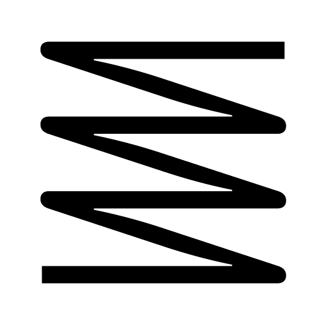
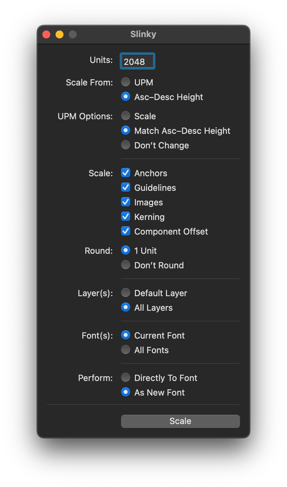

# Slinky

#### Slinky is a RoboFont extension for scaling your whole font up or down.

You can choose a precise measurement (either UPM or Ascender-to-Descender height), set some settings, and it will do the rest.

## Units

Enter your desired measurement here, measured in units.

## Scale From

This is what your measurement will correspond to. You can scale based on UPM, or your ascender-to-descender height. If you scale your UPM, everything (chosen to be scaled) will be scaled proportionately. If you scale your Ascender-to-Descender height, you'll have the option on how/whether UPM is changed...

## UPM Options

These options are only available when Asc-Desc Height is enabled:

#### Scale

Scale the UPM proportionately to how you're scaling the ascender-to-descender height is being scaled. This will ensure the relationship between your font dimensions and your UPM is maintained.

#### Match Asc-Desc Height

This will snap the UPM to match the Unit measurement provided and match the distance between your ascender and descender.

#### Don’t Change

This will leave UPM unaffected while everything else scales around it. This is useful, for instance, if you've already got your UPM where you want it, but your glyphs/font dimensions are too small/big.

## Scale

These are things you can choose to scale along with everything else. Usually it’s a good idea to leave all of these checked. 
> Note: Components themselves will not be scaled, as this would scale things twice. However, it is recommended you scale the Component Offset (i.e. the positioning of the components). This will most likely lead to the desired results.

## Round

When you scale drawings, there may be `float` numbers that no longer fit the grid you're working on. If you'd like to leave them `float` for now, choose Don’t Round. If you'd like your final drawings to be shimmied a bit to fit a 1-unit grid, choose 1 Unit.

## Layer(s)

Choose which layers you’d like to scale, either just the default layer (usually named “foreground”), or all layers.

## Font(s)

Choose which fonts you’d like to scale, either just the front-most `CurrentFont`, or all open fonts.

## Perform...

Choose whether you’d like to scale the font in-place, or whether you'd like Slinky to make a copy first and _then_ scale. 

> Note: If you scale the font in-place, just remember that it’s difficult to Undo this action. Be sure your work is saved before clicking Scale. In case the wrong move is made here, you can then close and reopen the UFO. It might be a good idea to try out “As New Font” and check the results before committing the same settings to the actual UFO in question.